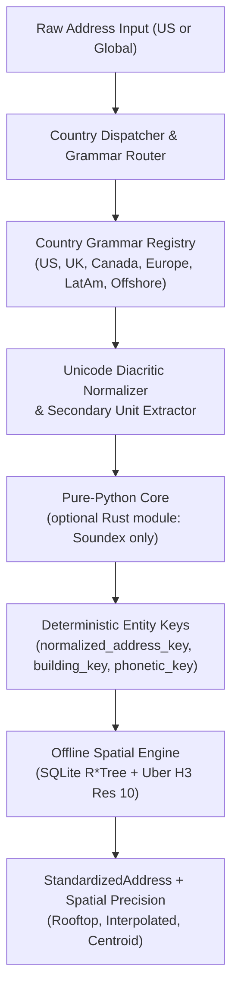

# Address Standardizer

[](https://github.com/Jacob-white/Address-Standardizer)
[](https://github.com/Jacob-white/Address-Standardizer/actions/workflows/ci.yml)
[](https://github.com/Jacob-white/Address-Standardizer)
[](https://python.org)
[](https://opensource.org/licenses/MIT)
[](https://pe.usps.com/text/pub28/welcome.htm)

A standalone multi-national address standardization, offline spatial geocoding, and cross-border corporate entity resolution library (with an optional HTTP service). It parses, normalizes, validates, deduplicates, and geocodes physical addresses with a country registry covering all 249 ISO-3166-1 countries and territories, with no third-party vendor lock-in or recurring cloud API fees for the offline paths. Throughput is in the low thousands of mixed real-world addresses per second per process in pure Python (see [Performance](#performance-measured)). Owned and maintained by **HobbyHabbit LLC** under the **MIT License**.

---

## 📚 Documentation & Quickstarts

- **[Quickstart Guide](docs/quickstart.md)** — Step-by-step onboarding for address parsing, international detection, offline spatial geocoding, streaming batch, and the HTTP service.
- **[API Reference](docs/api_reference.md)** — Reference for the Python models, functions, CLI commands, and microservice endpoints.
- **[Multi-Platform Client SDKs](sdks/README.md)** — Official client libraries for TypeScript/React, .NET, and Go.
- **[Security Policy & Sandboxing Guide](SECURITY.md)** — Threat model, memory safety, air-gapped spatial execution, FinCEN anti-fraud invariants, and vulnerability disclosure procedures.
- **[Architectural Specifications Index](docs/README.md)** — Engineering roadmaps and design notes.
- **[Releasing](docs/RELEASING.md)** — Release process and publishing status.

---

## Table of Contents

- [Documentation & Quickstarts](#-documentation--quickstarts)
- [Highlights & Enterprise Capabilities](#highlights--enterprise-capabilities)
- [Architecture & Standards](#architecture--standards)
- [Installation](#installation)
- [Python API Quickstart](#python-api-quickstart)
  - [1. Domestic US Address Standardization](#1-domestic-us-address-standardization)
  - [2. Universal 249 ISO-3166-1 Country Registry & Detection](#2-universal-249-iso-3166-1-country-registry--detection)
  - [3. Global Postal Code Validation & Extraction Engine](#3-global-postal-code-validation--extraction-engine)
  - [4. Regional Grammar Families & Multi-Script Normalization](#4-regional-grammar-families--multi-script-normalization)
  - [5. UPU S42-style Address Layout Formatting](#5-upu-s42-style-address-layout-formatting)
  - [6. Offline Spatial Geocoding & H3 Indexing](#6-offline-spatial-geocoding--h3-indexing)
  - [7. Cross-Border Corporate Transparency & Entity Resolution](#7-cross-border-corporate-transparency--entity-resolution)
  - [8. Confidence Scoring & Routing Tiers](#8-confidence-scoring--routing-tiers)
  - [9. Delivery Intelligence (DPV-style footnotes & RDI)](#9-delivery-intelligence-dpv-style-footnotes--rdi)
  - [10. Real-Time Autocomplete Engine](#10-real-time-autocomplete-engine)
  - [11. Batch & Streaming](#11-batch--streaming)
- [Command Line Interface (CLI)](#command-line-interface-cli)
- [HTTP Service & Docker](#http-service--docker)
- [Data Model (`StandardizedAddress`)](#data-model-standardizedaddress)
- [Verification & Benchmarks](#verification--benchmarks)
- [Security Policy](#security-policy)
- [License](#license)

---

## Highlights & Enterprise Capabilities

- **Universal 249 ISO-3166-1 Country Registry & Auto-Detection:**
  - Catalog of all 249 ISO-3166-1 countries and dependent territories with alpha-2, alpha-3, numeric codes, official names, native names, and common aliases.
  - Contextual country detector resolving destinations from trailing sovereign names and national postal patterns.
- **Global Postal Code Validation & Extraction Engine:**
  - Pattern validation and length bounds for the 194 countries/territories in the registry that issue postal codes.
  - Graceful handling of the 55 non-postal jurisdictions (UAE, Qatar, Panama, Bahamas, Seychelles, etc.) without false rejection.
  - Postal code extractor isolating postal codes from unformatted or noisy international address lines.
- **Regional Grammar Families & Multi-Script Normalization:**
  - **East Asia / CJK (`JPN`, `CHN`, `KOR`, `TWN`):** Prefectures, wards, chome-ban-go, Chinese provinces/districts/roads, Korean road-name systems, Taiwanese hierarchical sections.
  - **Latin America & Caribbean (`MEX`, `BRA`, `COL`, `ARG`, `CHL`):** Colonias, fraccionamientos, manzana/lote, Brazilian CEP & logradouros, Colombian `#` intersection numbering (`Carrera 7 # 71-21`).
  - **Nordic & Germanic Europe (`DEU`, `AUT`, `CHE`, `NLD`, `FIN`, `SWE`, `NOR`, `DNK`):** Compound thoroughfare words, Finnish suffixes (`katu`, `tie`), Nordic floor/door designators.
  - **Eastern Europe & Cyrillic (`POL`, `CZE`, `ROU`, `GRC`, `BGR`, `SRB`, `UKR`):** Prefix street designators (`ul.`, `str.`, `ул.`), house slashes (`10/12`), localized apartment designators (`lok.`, `кв.`).
  - **Middle East & Africa (`ARE`, `SAU`, `EGY`, `ZAF`, `NGA`, `KEN`):** PO Box routing and regional address layouts.
  - **Multi-Script Unicode Fidelity:** Native script preserved in user-facing fields (Kanji, Hanzi, Hangul, Cyrillic, Greek, Arabic), with ASCII-folded matching keys.
  - Coverage depth varies by country; see `benchmarks/data/golden_dataset_multinational.json` for the cases that are regression-tested.
- **Universal Postal Union (UPU S42)-style Address Layout Formatter:**
  - Envelope layout generator for international conventions: European postal-first (`10117 Berlin`), Anglo-Saxon postal-last (`New York, NY 10005`), East Asian top-down (`〒106-6132 ...`), and non-postal layouts.
- **Unicode NFKD Diacritic Normalization:**
  - NFKD decomposition separating combining accents while generating deterministic ASCII matching keys; human-readable localized fields are preserved.
- **Offline Spatial Geocoding (no network calls):**
  - Zero external network or cloud API calls on the offline path (the `--geocode` flag, which uses the US Census API, is separate and opt-in).
  - SQLite `R*Tree` virtual tables for indexed bounding-box lookups. The built-in index is only a tiny sample (a handful of points plus postal and municipal centroids); build a real database from your own data with `spatial build`.
  - Uber H3 resolution 10 cell identifiers from the real `h3` library (a required dependency, so identifiers are interoperable with other H3 tools; invalid or out-of-range coordinates raise `ValueError` rather than being clamped).
  - 4-stage resolution cascade: `CONFIRMED_ROOFTOP` (1) &rarr; `RANGE_INTERPOLATED` (2) &rarr; `POSTAL_CENTROID` (3) &rarr; `MUNICIPAL_CENTROID` (4), else `UNRESOLVED`.
  - ETL ingestion for OpenAddresses (CSV), TIGER street segments (CSV), and OpenStreetMap building features (GeoJSON).
- **Pure-Python Core with an Optional Native Module:**
  - The pure-Python core (`_pure_python_core.py`) is the reference implementation and handles everything.
  - An optional Rust/PyO3 extension (`_address_standardizer_rs`, built with `maturin`) currently accelerates **Soundex only**; all other work stays in Python. It is not required and not installed by `pip install`. Set `ADDRESS_STANDARDIZER_FORCE_PURE=1` to disable it.
  - Streaming batch processing reads files in bounded chunks (default 5,000 rows) rather than loading the whole file.
- **ZIP / State Consistency Policy:**
  - By default the supplied US state is kept; a ZIP that contradicts it is flagged `ERR_ZIP_STATE_MISMATCH` and the address is marked `UNDELIVERABLE`.
  - Opt in with `correct_state_from_zip=True` (CLI: `--correct-state-from-zip`) to replace the state with the ZIP's state; this is reported as `WARN_STATE_CORRECTED_FROM_ZIP`.
- **Cross-Border Corporate Transparency & FinCEN CTA/BOI Heuristics:**
  - Curated registry of corporate formation hubs (Delaware, Wyoming, London, Zurich, Frankfurt, Cayman Islands, BVI, Panama). This is a screening aid, not legal or compliance advice.
  - 3 anti-fraud invariants:
    1. *Multi-Tenant Skyscraper Suite Isolation:* High-rise commercial towers (e.g. 28 Liberty St) only flag when the specific floor/suite matches the corporate service provider.
    2. *Private Residence Protection:* Prohibits merging commercial corporate entities into residential homes.
    3. *Formation Hub Co-Location Isolation:* Prohibits merging separate entities co-located at registered-agent hubs without secondary unit confirmation.
  - Domestic namesake collision protection (e.g. London OH, Paris TX) against false offshore flags.
- **Confidence Scoring & Routing Tiers:**
  - Composite multi-factor confidence score (0.0 to 1.0) routing addresses to `AUTO_PASS` (&ge; 0.95), `FUZZY_REVIEW` (0.80 &ndash; 0.95), or `MANUAL_STEWARDSHIP` (< 0.80).
- **Delivery Intelligence (USPS DPV-style footnotes & RDI):**
  - Heuristic DPV footnote codes (`AA`, `BB`, `CC`, `N1`, `M1`, `PB`, ...) and Residential Delivery Indicator (Commercial / Residential / Unknown). These are rule-based estimates, not a USPS-licensed DPV lookup.
- **Real-Time Autocomplete & Typeahead Engine:**
  - In-memory prefix trie with secondary-unit prompting (sub-millisecond on the built-in sample data; see [Performance](#performance-measured)).
- **Multi-Tier Reference Caching:**
  - Process-local L1 LRU memory cache paired with an embedded L2 SQLite WAL persistent store.

---

## Architecture & Standards



- **Standards the formatting and parsing are modeled on:** USPS Publication 28, Universal Postal Union (UPU) S42, ISO 19160-4 (addressing components), Royal Mail PAF / BS 7666, Canada Post addressing standards. The library is not certified by any of these bodies.
- **Regulatory context:** FinCEN Corporate Transparency Act (CTA/BOI), EU 6th Anti-Money Laundering Directive (6AMLD). The corporate-hub registry is a heuristic screening aid.
- **Spatial data sources supported by the ingestors:** US Census TIGER/Line (street-segment CSV), OpenAddresses (CSV), OpenStreetMap (building GeoJSON), Uber H3.

---

## Installation

Requires **Python 3.11+**. The only hard dependency is `requests`.

The package is not guaranteed to be published on PyPI yet (see [docs/RELEASING.md](docs/RELEASING.md), which lists the one-time PyPI setup and what was verified locally). Install from a clone:

```bash
git clone https://github.com/Jacob-white/Address-Standardizer.git
cd Address-Standardizer

# Base package
pip install -e .

# HTTP service (FastAPI + uvicorn)
pip install -e ".[server]"
```

Optional extras (declared in `pyproject.toml`):

| Extra | Adds |
| :--- | :--- |
| `server` | `fastapi`, `uvicorn`, `pydantic`, `httpx` for `address-standardizer serve` |
| `ml` | `usaddress` (CRF-based US parser) |
| `arrow` | `pyarrow`, `polars`, `duckdb`, `numpy` for `address_standardizer.arrow` (`standardize_arrow`, `standardize_polars`, `register_duckdb_udfs`) |
| `benchmark` | `psutil` for memory measurements |
| `dev` | `pytest`, `pytest-cov`, `ruff`, `hypothesis`, `usaddress` |

```bash
pip install -e ".[ml]"          # or ".[arrow]", ".[benchmark]"
pip install -e ".[dev]"         # development & testing
```

Optional native module (Soundex only; requires a Rust toolchain and `pip install maturin`):

```bash
maturin develop --release
```

---

## Python API Quickstart

All outputs below were produced by running the snippets against the current code (Python 3.13). See the [Quickstart](docs/quickstart.md) and [API Reference](docs/api_reference.md) for more.

### 1. Domestic US Address Standardization
```python
from address_standardizer import standardize_address

addr = standardize_address("100 Wall Street, Suite 400, New York, NY 10005")

print(addr.street1)                 # "100 WALL ST"
print(addr.street2)                 # "STE 400"
print(addr.city)                    # "NEW YORK"
print(addr.state)                   # "NY"
print(addr.postal_code)             # "10005"
print(addr.normalized_address_key)  # "100 WALL ST|STE 400|NEW YORK|NY|10005|USA"
print(addr.building_key)            # "100 WALL ST||NEW YORK|NY|10005|USA"
print(addr.address_status)          # "standardized"
print(addr.confidence_score)        # 0.988
print(addr.routing_tier)            # "AUTO_PASS"
print(addr.rdi)                     # <RDI.COMMERCIAL: 'Commercial'>
```

ZIP/state policy: the supplied state is kept and a contradicting ZIP is flagged. Correction is opt-in and currently applies to structured (field-based) input:

```python
bad = standardize_address(street1="100 Main St", city="Los Angeles", state="NY", postal_code="90012")
print(bad.state, bad.failure_reason_codes, bad.deliverability)
# NY ['ERR_ZIP_STATE_MISMATCH'] Deliverability.UNDELIVERABLE

fixed = standardize_address(street1="100 Main St", city="Los Angeles", state="NY", postal_code="90012",
                            correct_state_from_zip=True)
print(fixed.state, fixed.failure_reason_codes)
# CA ['WARN_STATE_CORRECTED_FROM_ZIP']
```

### 2. Universal 249 ISO-3166-1 Country Registry & Detection
```python
from address_standardizer import CountryRegistry, standardize_address

germany = CountryRegistry.get("DE")
print(germany.alpha3)           # "DEU"
print(germany.numeric)          # "276"
print(germany.name)             # "Germany"
print(germany.has_postal_codes) # True

addr = standardize_address("Torstr. 100, 10119 Berlin, Deutschland")
print(addr.country)             # "DEU"

# Explicit country override accepts ISO-2, ISO-3, numeric code, or name
res_jp = standardize_address("Chiyoda 1-1, Tokyo", country="JPN")
print(res_jp.country)           # "JPN"
```

### 3. Global Postal Code Validation & Extraction Engine
```python
from address_standardizer import validate_postal_code, extract_postal_code

assert validate_postal_code("10117", country="DEU") is True

detail = validate_postal_code("10117", country="DEU", return_details=True)
print(detail.is_valid)              # True
print(detail.formatted_code)        # "10117"
print(detail.reason)                # "Valid postal code format"

# Non-postal countries validate gracefully
uae = validate_postal_code("", country="ARE", return_details=True)
print(uae.is_valid)                 # True
print(uae.is_non_postal_country)    # True

print(extract_postal_code("Munich D-80331 Germany", country="DEU"))  # "80331"
```

### 4. Regional Grammar Families & Multi-Script Normalization
```python
from address_standardizer import standardize_address

# East Asia / CJK: native script preserved
jp = standardize_address("東京都港区六本木6-10-1 六本木ヒルズ森タワー 32階 106-6132", country="JPN")
print(jp.state)        # "東京都"
print(jp.city)         # "港区"
print(jp.postal_code)  # "106-6132"
print(jp.street1)      # "六本木ヒルズ森タワー 六本木6-10-1"
print(jp.street2)      # "32階"

# Latin America: colonias, intersection '#' syntax
mx = standardize_address("Av. Insurgentes Sur 1602, Int. 401, Col. Crédito Constructor, 03940 Ciudad de México, CDMX, Mexico")
print(mx.street1)      # "AV INSURGENTES SUR 1602"
print(mx.street2)      # "INT 401"
print(mx.city)         # "CIUDAD DE MÉXICO"
print(mx.state)        # "CDMX"
print(mx.postal_code)  # "03940"
print(mx.country)      # "MEX"

# Germanic Europe
de = standardize_address("Musterstraße 12, 10115 Berlin, Germany")
print(de.street1)      # "MUSTERSTRASSE 12"
print(de.postal_code)  # "10115"

# Eastern Europe: prefix streets & house slashes
pl = standardize_address("ul. Marszałkowska 10/12, m. 14, 00-026 Warszawa, Poland")
print(pl.street1)                 # "UL. MARSZAŁKOWSKA 10/12"
print(pl.street2)                 # "M. 14"
print(pl.city)                    # "WARSZAWA"
print(pl.postal_code)             # "00-026"
print(pl.normalized_address_key)  # "UL. MARSZALKOWSKA 10/12|M. 14|WARSZAWA||00-026|POL"

# Middle East: PO Box routing (the UAE has no postal codes)
ae = standardize_address("Sheikh Zayed Road, P.O. Box 12345, Trade Centre 1, Dubai, United Arab Emirates")
print(ae.street1)      # "SHEIKH ZAYED RD"
print(ae.street2)      # "PO BOX 12345"
print(ae.city)         # "DUBAI"
print(ae.country)      # "ARE"
```

### 5. UPU S42-style Address Layout Formatting
```python
from address_standardizer import standardize_address, format_upu_address

de_addr = standardize_address("Musterstraße 12, 10115 Berlin, Germany")
print(format_upu_address(de_addr))
# MUSTERSTRASSE 12
# 10115 BERLIN
# GERMANY

us_addr = standardize_address("100 Wall Street, Suite 400, New York, NY 10005")
print(us_addr.format_upu())
# 100 WALL ST
# STE 400
# NEW YORK, NY 10005
# UNITED STATES

jp_addr = standardize_address("東京都港区六本木6-10-1 六本木ヒルズ森タワー 32階 106-6132", country="JPN")
print(jp_addr.format_upu())
# 〒106-6132
# 東京都港区六本木ヒルズ森タワー 六本木6-10-1
# 六本木ヒルズ森タワー 32階
# JAPAN
```

### 6. Offline Spatial Geocoding & H3 Indexing
`resolve_spatial_coordinates` uses the offline SQLite R*Tree index. Out of the box that index only holds a small built-in sample (for example 100 Wall St); anything else falls back to postal or municipal centroids. Load real data with `address-standardizer spatial build` (see the CLI section).

```python
from address_standardizer import resolve_spatial_coordinates, lat_lng_to_h3, standardize_address

result = resolve_spatial_coordinates("100 Wall Street, New York, NY 10005")
print(result.latitude)                 # 40.7061
print(result.longitude)                # -74.006
print(result.precision)                # "CONFIRMED_ROOFTOP"
print(result.stage)                    # 1
print(result.accuracy_radius_meters)   # 3.0
print(result.h3_res10)                 # "8a2a1072885ffff"

# An address outside the sample data resolves to a coarser tier:
r2 = resolve_spatial_coordinates("350 5th Ave, New York, NY 10118")
print(r2.precision, r2.accuracy_radius_meters)   # POSTAL_CENTROID 8000.0

# Geocode while standardizing:
a = standardize_address("100 Wall Street, Suite 400, New York, NY 10005", enable_geocoding=True)
print(a.spatial_result.precision)      # "CONFIRMED_ROOFTOP"

# Direct lat/lng to H3 resolution 10 (real H3 cell ids from the `h3` package)
print(lat_lng_to_h3(40.7061, -74.006, resolution=10))   # "8a2a1072885ffff"
```

### 7. Cross-Border Corporate Transparency & Entity Resolution
```python
from address_standardizer import (
    lookup_corporate_registry,
    can_safely_merge_corporate_entities,
    standardize_address,
)

# 1. Registered Agent Hub Detection
hub = lookup_corporate_registry("1209 North Orange St, Wilmington, DE 19801")
print(hub.provider_name)          # "Corporation Trust Center (CT Corporation)"
print(hub.category)               # "COMMERCIAL_REGISTERED_AGENT"
print(hub.base_risk_score)        # 0.95

# 2. Skyscraper Suite Isolation: other tenants at 28 Liberty St are not flagged...
jpm = standardize_address("28 Liberty St, Floor 60, New York, NY 10005")
assert jpm.is_registered_agent_hub is False

# ...but the registered-agent floor is:
ct_corp = standardize_address("28 Liberty St, Floor 42, New York, NY 10005")
assert ct_corp.is_registered_agent_hub is True

# 3. Co-located entities at formation hubs must not be merged:
addr_a = standardize_address("1209 North Orange St, Wilmington, DE 19801")
addr_b = standardize_address("1209 North Orange St, Wilmington, DE 19801")
safe_to_merge, reason = can_safely_merge_corporate_entities(addr_a, addr_b)
assert safe_to_merge is False
print(reason)  # "CO_LOCATION_ISOLATION_INVARIANT: Both entities share a registered agent / formation hub building_key. ..."
```

### 8. Confidence Scoring & Routing Tiers
```python
from address_standardizer import compute_confidence_score, standardize_address

addr = standardize_address("100 Wall Street, Suite 400, New York, NY 10005")
res = compute_confidence_score(addr)

print(res.composite_score)        # 0.988
print(res.routing_tier)           # "AUTO_PASS"
print(res.failure_reason_codes)   # []
```

### 9. Delivery Intelligence (DPV-style footnotes & RDI)
```python
from address_standardizer import evaluate_delivery_intelligence

intel = evaluate_delivery_intelligence(
    street1="100 WALL ST",
    street2="STE 400",
    city="NEW YORK",
    state="NY",
    postal_code="10005",
)

print(intel.dpv_footnotes)        # ['AA', 'BB', 'CC']
print(intel.rdi)                  # <RDI.COMMERCIAL: 'Commercial'>
print(intel.deliverability)       # <Deliverability.DELIVERABLE: 'DELIVERABLE'>
print(intel.cmra, intel.vacant)   # False False
```

### 10. Real-Time Autocomplete Engine
```python
from address_standardizer import autocomplete_address

for s in autocomplete_address("350 5th Ave", max_results=5):
    print(s.text, s.secondary_prompt_required, s.suggested_secondary_units)
# 350 5TH AVE, NEW YORK, NY 10118 True ['STE 1000', 'STE 2000', 'FL 50']
```
Autocomplete is a prefix match over a small built-in index; the prefix `"350 Fifth"` (spelled-out ordinal) returns no suggestions.

### 11. Batch & Streaming

#### `batch_standardize`
Lazy generator over raw strings or component dictionaries, with optional `country` or per-row country inference:

```python
from address_standardizer import batch_standardize

addresses = [
    "100 Wall Street, Suite 400, New York, NY 10005",
    "14 High Street, Flat 2, Leeds, LS6 2AA, UK",
    {"street1": "Musterstraße 12", "city": "Berlin", "postal_code": "10115", "country": "DEU"},
]

for std in batch_standardize(addresses):
    print(f"{std.street1} -> {std.city}, {std.country} [{std.address_status}]")
# 100 WALL ST -> NEW YORK, USA [standardized]
# 14 HIGH ST -> LEEDS, GBR [standardized]
# MUSTERSTRASSE 12 -> BERLIN, DEU [standardized]
```

#### Chunked streaming (CSV & JSONL)
Process large CSV or line-delimited JSON files in bounded chunks. The functions return the number of records written:

```python
from address_standardizer import stream_standardize_csv, stream_standardize_jsonl

count = stream_standardize_jsonl(
    input_path="raw_addresses.jsonl",
    output_path="standardized_addresses.jsonl",
    mapping={"addr": "street1", "town": "city", "region": "state", "post": "postal_code"},
    chunk_size=5000,
)
print(f"Standardized {count} records")
```

---

## Command Line Interface (CLI)

Installing the package (even editable) provides the `address-standardizer` command; `python -m address_standardizer.cli` is equivalent. Subcommands: `parse`, `batch`, `benchmark`, `spatial` (`build`, `lookup`, `info`/`stats`), `audit`, `cache`, `autocomplete`, `validate-postal`, `serve`. Run `address-standardizer <subcommand> --help` for the exact flags.

### Single Address & Piped Stream Processing
```bash
# Shorthand single address (same as `parse`):
address-standardizer "100 Wall Street, Suite 400, New York, NY 10005"

# Explicit country (ISO code or name; default USA):
address-standardizer "Musterstraße 12, 10115 Berlin" --country DEU

# Envelope-ready UPU-style layout:
address-standardizer "100 Wall St, New York, NY 10005" --format upu

# Piped stream (one address per line), formats: json (default), text, table, csv, upu:
cat addresses.txt | address-standardizer
cat addresses.txt | address-standardizer --format csv
echo "100 Wall St, New York, NY 10005" | address-standardizer --format table

# Explicit stdin parsing:
address-standardizer parse - --format table

# Structured fields instead of a single string:
address-standardizer parse --street1 "100 Wall St" --city "New York" --state NY --zip 10005

# Enrichment flags on `parse`:
#   --enable-geocoding (offline R*Tree)   --spatial-db PATH   --geocode (US Census API, network)
#   --cascade   --confidence   --audit   --no-cache   --correct-state-from-zip
address-standardizer parse "100 Wall Street, Suite 400, New York, NY 10005" --enable-geocoding --confidence
```

Output of the last command (JSON):
```json
{
  "street1": "100 WALL ST",
  "street2": "STE 400",
  "city": "NEW YORK",
  "state": "NY",
  "postal_code": "10005",
  "country": "USA",
  "normalized_address_key": "100 WALL ST|STE 400|NEW YORK|NY|10005|USA",
  "building_key": "100 WALL ST||NEW YORK|NY|10005|USA",
  "phonetic_key": "100|W400|10005",
  "address_status": "standardized",
  "raw_street_address": "100 Wall Street, Suite 400, New York, NY 10005",
  "is_us": true,
  "is_private_residence": false,
  "is_registered_agent_hub": false,
  "country_iso3": "USA",
  "latitude": 40.7061,
  "longitude": -74.006,
  "spatial_precision": "CONFIRMED_ROOFTOP",
  "geocode_precision": "CONFIRMED_ROOFTOP",
  "spatial_source": "OPENADDRESSES",
  "accuracy_radius_meters": 3.0,
  "h3_r10_index": "8a2a1072885ffff",
  "spatial_result": {
    "latitude": 40.7061,
    "longitude": -74.006,
    "precision": "CONFIRMED_ROOFTOP",
    "accuracy_radius_meters": 3.0,
    "stage": 1,
    "source": "OPENADDRESSES",
    "h3_res10": "8a2a1072885ffff",
    "parcel_id": "NY-MAN-00100",
    "execution_time_ms": 0.069,
    "metadata": {}
  },
  "confidence_score": 0.988,
  "routing_tier": "AUTO_PASS",
  "failure_reason_codes": []
}
```
(`execution_time_ms` varies per run. Without `--enable-geocoding` and `--confidence`, only the first 15 keys are printed. `--include-intl` is a `batch` flag, not a `parse` flag.)

ZIP/state policy on the CLI: by default a state that contradicts the ZIP is kept and flagged `ERR_ZIP_STATE_MISMATCH` (address `UNDELIVERABLE`); add `--correct-state-from-zip` to `parse` or `batch` to replace the state from the ZIP (reported as `WARN_STATE_CORRECTED_FROM_ZIP`).

### Global Postal Code Validation (`validate-postal`)
Validate postal codes against national rules, extract them from raw text, and pipe via stdin. Formats: `json` (default), `text`, `table`.

```bash
address-standardizer validate-postal 10117 -c DEU --format table
address-standardizer validate-postal 10117 -c DEU --format json
address-standardizer validate-postal "Munich D-80331 Germany" -c DEU
address-standardizer validate-postal "" -c ARE            # non-postal country
echo "10117" | address-standardizer validate-postal - -c DEU
```

Sample output (`--format table`):
```
Postal Code     | Country | Valid | Formatted Code  | Non-Postal | Reason
-------------------------------------------------------------------------
10117           | DEU     | True  | 10117           | False      | Valid postal code format
```

### Batch Processing with Schema Mapping
Supports CSV, JSONL (`.jsonl`, `.ndjson`), and JSON array files with format auto-detection (`--format auto|csv|jsonl|ndjson|json`). Output keeps the input columns and appends `std_*` columns plus the matching keys. Other flags: `--chunk-size` (default 5000), `--workers` (max 2), `--country`, `--enable-geocoding`, `--spatial-db`, `--include-intl` (adds `std_dependent_locality`, `std_building_name`, `std_country_iso3`), `--confidence`, `--audit-csv`, `--no-cache`, `--correct-state-from-zip`.

```bash
# Batch CSV with column mapping:
address-standardizer batch inputs.csv outputs.csv \
  --mapping '{"addr": "street1", "town": "city", "st": "state", "zip": "postal_code"}'

# Country override for rows that do not carry their own country:
address-standardizer batch inputs.csv outputs.csv --country CAN

# Streaming JSONL with international columns and confidence:
address-standardizer batch records.jsonl standardized.jsonl \
  --mapping '{"address": "street1", "zip": "postal_code"}' \
  --chunk-size 5000 --include-intl --confidence
```

### Offline Spatial Geocoding Tool
```bash
# Resolve an address (JSON list of results; --format text is also available):
address-standardizer spatial lookup "100 Wall Street, New York, NY 10005"

# Radius or bounding-box queries against a database:
address-standardizer spatial lookup --lat 40.7061 --lon -74.006 --radius 500 --spatial-db data/spatial_index.db
address-standardizer spatial lookup --bbox -74.02,40.70,-73.99,40.72 --spatial-db data/spatial_index.db

# Index statistics (`info` and `stats` are aliases; without --spatial-db this reports the in-memory sample):
address-standardizer spatial stats

# Build an offline SQLite R*Tree database from open datasets:
address-standardizer spatial build --output data/spatial_index.db \
  --openaddresses path/to/openaddresses.csv \
  --tiger path/to/tiger_segments.csv \
  --osm path/to/osm_buildings.geojson
```
There is no `spatial ingest` subcommand; ingestion is done by `spatial build`.

### Performance & Regression Benchmarks
```bash
# Domestic benchmark (1,000 golden records, default):
address-standardizer benchmark

# Multinational (1,000 records), both (2,000), or a dataset file path:
address-standardizer benchmark --dataset multi_national
address-standardizer benchmark --dataset all
address-standardizer benchmark --dataset benchmarks/data/golden_dataset_multinational.json

# Machine-readable output and repeated runs:
address-standardizer benchmark --format json --iterations 3
```
The benchmark compares its throughput against built-in SLA thresholds and prints PASS/FAIL per row; throughput rows are hardware-dependent (see [Performance](#performance-measured)).

### Autocomplete & Typeahead
```bash
address-standardizer autocomplete "350 5th Ave"                 # text output
address-standardizer autocomplete "350 5th Ave" --format json --limit 5 --state NY
```

### Multi-Tier Cache Management
```bash
address-standardizer cache --stats
address-standardizer cache --clear
```

### Stewardship Audit Ledger
```bash
address-standardizer audit --list                       # recent ledger records
address-standardizer audit --list --status PENDING      # PENDING | APPROVED | MODIFIED | REJECTED
address-standardizer audit --export json                # json | sql | dict
address-standardizer audit --clear
```
`parse --audit` embeds the audit record in its output and `batch --audit-csv` writes them to a CSV. In a fresh process `audit --list` currently prints `[]` even after a separate `parse --audit` run, so do not rely on the CLI ledger persisting between invocations. There is no `audit --summary` flag.

---

## HTTP Service & Docker

```bash
pip install -e ".[server]"
address-standardizer serve                     # binds 127.0.0.1:8000 by default
address-standardizer serve --host 0.0.0.0 --port 8000 --workers 2   # expose deliberately
```

`serve` binds to **127.0.0.1** by default; pass `--host 0.0.0.0` only when you intend to listen on all interfaces. The service has no built-in authentication, so put it behind your own gateway if you expose it.

Endpoints: `GET /health`, `GET /metrics` (JSON or Prometheus), `POST /v1/standardize`, `POST /v1/batch` (JSON array or NDJSON), `POST /v1/autocomplete`, `GET /v1/autocomplete`. OpenAPI docs are served by default (disable with `ADDRESS_STANDARDIZER_DISABLE_DOCS=1`). See the [API Reference](docs/api_reference.md) for request and response shapes.

Limits and environment variables:
- `/v1/batch` rejects requests with more than **10,000** addresses with HTTP **413** (override with `ADDRESS_STANDARDIZER_MAX_BATCH`).
- Request bodies over 16 MiB are rejected with 413 (override with `ADDRESS_STANDARDIZER_MAX_BODY_BYTES`).
- `ADDRESS_STANDARDIZER_CORS_ORIGINS` (comma-separated) enables CORS for listed origins.

```bash
curl -s -X POST http://127.0.0.1:8000/v1/standardize \
  -H "Content-Type: application/json" \
  -d '{"address": "100 Wall St, New York, NY 10005"}'
```

### Docker
The `Dockerfile` is a two-stage build (Python 3.12-slim) that compiles the optional Rust module (Soundex only), installs the package with the `server` and `arrow` extras, runs as a non-root user, and starts `uvicorn address_standardizer.server:app` on `0.0.0.0:8000` *inside* the container with a `/health` healthcheck.

```bash
docker build -t address-standardizer .
docker run --rm -p 127.0.0.1:8000:8000 address-standardizer

# or, with the hardened compose file (read-only filesystem, dropped capabilities,
# port published on 127.0.0.1 only, 2 CPU / 2 GB limits):
docker compose -f docker-compose.service.yml up --build
```
Publish the port on `127.0.0.1` unless you deliberately want it reachable from other hosts. (These Docker commands were checked against the `Dockerfile` and compose file but not built in this review.)

---

## Data Model (`StandardizedAddress`)

`StandardizedAddress` is a dataclass whose stored fields are below. Quality, delivery, and spatial attributes (`confidence_score`, `routing_tier`, `failure_reason_codes`, `rdi`, `cmra`, `vacant`, `dpv_footnotes`, `deliverability`, `corporate_risk_score`, `corporate_risk_flags`, `spatial_result`, `latitude`, `longitude`, `precision`, `country_iso3`, ...) are properties populated by the standardization pipeline; they are `None` or defaults until the relevant step has run.

```python
@dataclass
class StandardizedAddress:
    # Core components
    street1: str
    street2: str
    city: str
    state: str
    postal_code: str
    country: str                          # ISO-3166-1 alpha-3, e.g. "USA"

    # Deterministic matching & deduplication keys
    normalized_address_key: Optional[str]
    building_key: Optional[str] = None
    phonetic_key: Optional[str] = None

    # Status & input
    address_status: str                   # 'standardized' | 'pending' | 'parse_failed' | 'manual_override' | 'locality_only' | 'city_level'
    raw_street_address: str
    is_us: bool

    # Entity resolution flags
    is_registered_agent_hub: bool = False
    is_private_residence: bool = False

    # International extended attributes
    dependent_locality: Optional[str] = None
    building_name: Optional[str] = None
    rooftop_address: Optional[str] = None
```

`addr.as_dict()` (equivalently `as_dict(include_metadata=False)`) returns a stable 14-key dictionary: `street1`, `street2`, `city`, `state`, `postal_code`, `country`, `normalized_address_key`, `building_key`, `phonetic_key`, `address_status`, `raw_street_address`, `is_us`, `is_private_residence`, `is_registered_agent_hub`. `as_dict(include_metadata=True)` (or `as_extended_dict()`) adds confidence, routing, delivery, corporate-risk, and spatial fields.

---

## Verification & Benchmarks

The repository ships unit tests, property-based fuzzing (Hypothesis), and two golden datasets (domestic and multinational).

### Test suite (measured)

```bash
python -m pytest tests -q -p no:cacheprovider -m "not perf" --cov=address_standardizer --cov-report=term
```

- **1,369 passed, 3 skipped** (7 `perf`-marked tests deselected; run them separately without coverage via `pytest -m perf`).
- **89.96% statement coverage** (`fail_under = 85` is enforced in `pyproject.toml`). Coverage is not 100%.
- `ruff check address_standardizer tests benchmarks` reports no errors.

Counts and coverage are from a run on 2026-10-08 and will drift as tests are added.

### Golden dataset results

| Golden Dataset | Records | Passed | Accuracy | SLA Target |
| :--- | :--- | :--- | :--- | :--- |
| Domestic US (9 categories) | 1,000 | 1,000 | 100.0% | &ge; 99.5% |
| Multinational (`benchmarks/data/golden_dataset_multinational.json`, 6 categories) | 1,000 | 1,000 | 100.0% | &ge; 99.5% |

These are regression datasets generated by scripts in `benchmarks/` (see `benchmarks/data/multinational_expected_overrides.json` for the reviewed overrides). A 100% result means no regression against the recorded expectations; it is not an independent accuracy estimate on real-world data.

### Performance (measured)

Single process, pure-Python core (no native module), Windows 11, Python 3.13.5, run via `address-standardizer benchmark` on a developer workstation with other processes running. Numbers vary run to run and by hardware, so treat them as order-of-magnitude:

| Workload | Measured |
| :--- | :--- |
| Clean structured input (repeated, cache-assisted) | ~38,000 &ndash; 88,000 rec/s across runs |
| Mixed real-world golden batch | ~1,100 &ndash; 1,700 rec/s; p99 latency ~2.4 &ndash; 4.4 ms |
| Peak RSS during benchmark | ~90 &ndash; 105 MB |
| `standardize_address` single call, no cache | p50 ~1.2 ms, p99 ~1.9 ms |
| Offline spatial lookup on the built-in sample | p50 ~0.02 ms, p99 ~0.05 ms |
| Autocomplete on the built-in sample | p50 ~0.04 ms, p99 ~0.08 ms |

The built-in benchmark SLA gate targets 2,000 rec/s on mixed input and currently reports FAIL on that row on this machine (the other rows PASS). Treat the mixed-batch figure as the realistic throughput. The spatial and autocomplete figures are for the tiny built-in sample data, not for a full national database. Re-run `address-standardizer benchmark` and the scripts in `benchmarks/` to measure on your hardware.

---

## Security Policy

Security is a foundational pillar of Address Standardizer. For details on our threat model, defensive architecture, air-gapped spatial execution, and Coordinated Vulnerability Disclosure (CVD) policy, please review our **[SECURITY.md](SECURITY.md)**.

To report security vulnerabilities, email `security@hobbyhabbit.com`, `support@hobbyhabbit.com`, and `jake@hobbyhabbit.com`.

---

## License

This project is licensed under the MIT License — see the [LICENSE](LICENSE) file for details.
Copyright © 2026 HobbyHabbit LLC.
