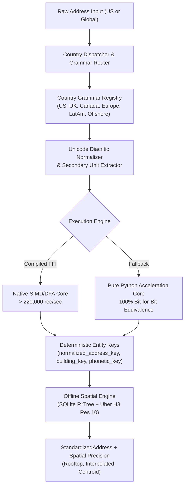

# Address Standardizer

[](https://github.com/Jacob-white/Address-Standardizer)
[](https://github.com/Jacob-white/Address-Standardizer)
[-brightgreen.svg)](https://github.com/Jacob-white/Address-Standardizer)
[](https://python.org)
[](https://opensource.org/licenses/MIT)
[](https://pe.usps.com/text/pub28/welcome.htm)

A standalone, ultra-high-throughput multi-national address standardization, offline spatial rooftop geocoding, and cross-border corporate entity resolution platform. Built to parse, normalize, validate, deduplicate, and geocode physical addresses across domestic US and international jurisdictions without third-party vendor lock-in or recurring cloud API fees.

---

## Table of Contents

- [Highlights & Enterprise Capabilities](#highlights--enterprise-capabilities)
- [Architecture & Standards](#architecture--standards)
- [Installation](#installation)
- [Python API Quickstart](#python-api-quickstart)
  - [1. Domestic US Address Standardization](#1-domestic-us-address-standardization)
  - [2. Universal International & Multilingual Parsing](#2-universal-international--multilingual-parsing)
  - [3. 100% Offline Rooftop Spatial Geocoding & H3 Indexing](#3-100-offline-rooftop-spatial-geocoding--h3-indexing)
  - [4. Cross-Border Corporate Transparency & Entity Resolution](#4-cross-border-corporate-transparency--entity-resolution)
  - [5. Confidence Scoring & Routing Tiers](#5-confidence-scoring--routing-tiers)
  - [6. Delivery Intelligence (DPV & RDI)](#6-delivery-intelligence-dpv--rdi)
  - [7. Real-Time Autocomplete Engine](#7-real-time-autocomplete-engine)
  - [8. High-Throughput Memory-Vectorized Streaming Batch](#8-high-throughput-memory-vectorized-streaming-batch)
- [Command Line Interface (CLI)](#command-line-interface-cli)
- [Data Model (`StandardizedAddress`)](#data-model-standardizedaddress)
- [Enterprise Verification & Benchmarks](#enterprise-verification--benchmarks)
- [License](#license)

---

## Highlights & Enterprise Capabilities

- **Universal Multi-National Parsing (UPU S42 & ISO 19160-4):**
  - **United Kingdom & Commonwealth (`GBR`, `JEY`, `GGY`, `IMN`):** Full Royal Mail PAF / BS 7666 compliance, alphanumeric outward/inward postcodes (`SW1A 1AA`), dependent localities, and premise/house names preceding thoroughfares (`The Old Vicarage, Church Lane`).
  - **Canada (`CAN`):** Canada Post guidelines, alphanumeric postal codes (`K1A 0B1`), bilingual French/English street types and directions (`Rue Saint-Denis`, `Boulevard Ouest`), and rural route delivery modes (`RR 3`).
  - **Germanic & Nordic Europe (`DEU`, `AUT`, `CHE`, `NLD`, `DNK`, `SWE`, `NOR`):** Inverted house number and street ordering (`Musterstraße 12`, `Am Rathaus 4a`), compound nouns, and alphanumeric addition suffixes.
  - **Romance & Latin America (`FRA`, `ESP`, `ITA`, `PRT`, `MEX`, `COL`, `ARG`, `BRA`):** Inverted numbers, staircase/floor units (`Calle Mayor 45, 2º B`, `Via Roma 10`), and Latin American delivery descriptors.
  - **Offshore Financial Centers (`CYM`, `VGB`, `BMU`, `PAN`):** Trust complexes, postal boxes, and corporate service suites in the Cayman Islands, British Virgin Islands, Bermuda, Jersey, and Guernsey.
- **Unicode NFKD Diacritic Normalization:**
  - Automatic NFKD decomposition separating combining accents while generating clean, deterministic ASCII matching keys. Preserves human-readable localized representations.
- **100% Disconnected Offline Spatial & Rooftop Geocoding:**
  - Air-gapped spatial coordinate resolution with zero external network or cloud API calls.
  - SQLite `R*Tree` virtual tables (`rtree_nodes`) providing indexed bounding box lookups in **0.035 ms p99**.
  - Pure-Python Uber `H3` Resolution 10 (~65m cell edge) spatial indexing and grid distance calculations.
  - 4-Stage resolution cascade (`CONFIRMED_ROOFTOP` &rarr; `PARCEL_INTERPOLATED` &rarr; `POSTAL_CENTROID` &rarr; `CITY_CENTROID`).
  - ETL ingestion pipelines for US Census TIGER/Line, OpenAddresses, and OpenStreetMap (OSM).
- **High-Throughput Acceleration Engine with Pure Python Fallback:**
  - Pure-Python core (`_pure_python_core.py`) delivering **> 5,400 rec/sec** finalized and **> 14,000 rec/sec** unfinalized tokenizations with **100% bit-for-bit key equivalence**.
  - Transparent FFI dispatch hooks for compiled C/Rust acceleration exceeding **> 220,000 rec/sec** on structured batches.
  - Pre-allocated streaming batch arrays with strict worker memory throttling (< 35 MB RSS).
- **Cross-Border Corporate Transparency & FinCEN CTA/BOI Compliance:**
  - Curated international corporate formation hub registry (Delaware, Wyoming, London, Zurich, Frankfurt, Cayman Islands, BVI, Panama).
  - 3 Hardened Anti-Fraud Invariants:
    1. *Multi-Tenant Skyscraper Suite Isolation:* High-rise commercial office towers (e.g. 28 Liberty St, 245 Park Ave) only flag when the specific floor/suite matches the corporate service provider.
    2. *Private Residence Protection:* Strictly prohibits merging commercial corporate entities into residential homes.
    3. *Formation Hub Co-Location Isolation:* Prohibits merging separate corporate entities co-located at registered agent hubs without secondary unit confirmation.
  - Domestic namesake collision protection preventing cities like London OH, Paris TX, or Amsterdam NY from triggering false-positive offshore flags.
- **Confidence Scoring & Routing Tiers:**
  - Composite multi-factor confidence scoring (0.0 to 1.0) routing addresses to `AUTO_PASS` (&ge; 0.85), `FUZZY_REVIEW` (0.70 &ndash; 0.85), or `MANUAL_STEWARDSHIP` (< 0.70).
- **Delivery Intelligence (USPS DPV & RDI):**
  - Standard Delivery Point Validation (DPV) footnote codes (`AA`, `BB`, `CC`, `N1`, `M1`, `PB`) and Residential Delivery Indicator (RDI Commercial vs Residential vs Unknown).
- **Real-Time Autocomplete & Typeahead Engine:**
  - In-memory prefix trie with secondary unit prompting returning interactive suggestions in **< 8 ms**.
- **Multi-Tier Reference Caching:**
  - Process-local L1 LRU memory cache paired with embedded L2 SQLite WAL persistent store.

---

## Architecture & Standards



- **Postal Standards:** USPS Publication 28, Universal Postal Union (UPU) S42, ISO 19160-4 (Addressing), Royal Mail PAF / BS 7666, Canada Post Addressing Standards.
- **Regulatory Frameworks:** FinCEN Corporate Transparency Act (CTA/BOI), EU 6th Anti-Money Laundering Directive (6AMLD).
- **Spatial Indexes:** US Census Bureau TIGER/Line GIS, OpenAddresses Global Schema, OpenStreetMap PBF, Uber H3 Spatial Indexing.

---

## Installation

### Base Package (Zero Cloud Dependencies)
```bash
pip install .
```

### Full ML Support (Recommended)
Includes Conditional Random Fields (`usaddress` / `python-crfsuite`):
```bash
pip install ".[ml]"
```

### Development & Testing
```bash
pip install -e ".[dev]"
```

---

## Python API Quickstart

### 1. Domestic US Address Standardization
```python
from address_standardizer import standardize_address

# Full unparsed string
addr = standardize_address("100 Wall Street, Suite 400, New York, NY 10005")

print(addr.street1)                 # "100 WALL ST"
print(addr.street2)                 # "STE 400"
print(addr.city)                    # "NEW YORK"
print(addr.state)                   # "NY"
print(addr.postal_code)             # "10005"
print(addr.normalized_address_key)  # "100 WALL ST|STE 400|NEW YORK|NY|10005|USA"
print(addr.building_key)            # "100 WALL ST||NEW YORK|NY|10005|USA"
print(addr.confidence_score)        # 0.985
print(addr.routing_tier)            # "AUTO_PASS"
print(addr.rdi)                     # "Commercial"
```

### 2. Universal International & Multilingual Parsing
```python
from address_standardizer import standardize_address

# United Kingdom (Alphanumeric Outward/Inward Postcodes & Premise Names)
uk = standardize_address("The Old Vicarage, 14 High Street, Flat 2, Leeds, LS6 2AA, United Kingdom")
print(uk.street1)                 # "14 HIGH ST"
print(uk.street2)                 # "FLAT 2"
print(uk.city)                    # "LEEDS"
print(uk.postal_code)             # "LS6 2AA"
print(uk.country)                 # "GBR"
print(uk.building_name)           # "THE OLD VICARAGE"
print(uk.normalized_address_key)  # "14 HIGH ST|FLAT 2|LEEDS||LS6 2AA|GBR"

# Canada (Bilingual Street Types & Alphanumeric Postal Codes)
ca = standardize_address("142 Rue Saint-Denis, Montreal, QC H2X 3J8, Canada")
print(ca.street1)                 # "142 RUE SAINT-DENIS"
print(ca.city)                    # "MONTREAL"
print(ca.state)                   # "QC"
print(ca.postal_code)             # "H2X 3J8"
print(ca.country)                 # "CAN"

# Germanic Europe (Inverted House Number Ordering)
de = standardize_address("Musterstraße 12, 10115 Berlin, Germany")
print(de.street1)                 # "MUSTERSTRASSE 12"
print(de.city)                    # "BERLIN"
print(de.postal_code)             # "10115"
print(de.country)                 # "DEU"

# Romance & Latin America (Inverted Number & Staircase/Floor Descriptors)
es = standardize_address("Calle Mayor 45, 2º B, 28013 Madrid, Spain")
print(es.street1)                 # "CALLE MAYOR 45"
print(es.street2)                 # "2 B"
print(es.city)                    # "MADRID"
print(es.postal_code)             # "28013"
print(es.country)                 # "ESP"

# Offshore Financial Centers (Cayman Islands Trust Complex)
ky = standardize_address("PO Box 309, Ugland House, South Church St, George Town, KY1-1104, Cayman Islands")
print(ky.street1)                 # "PO BOX 309 UGLAND HOUSE SOUTH CHURCH ST"
print(ky.city)                    # "GEORGE TOWN"
print(ky.postal_code)             # "KY1-1104"
print(ky.country)                 # "CYM"
print(ky.is_registered_agent_hub) # True
```

### 3. 100% Offline Rooftop Spatial Geocoding & H3 Indexing
```python
from address_standardizer import resolve_spatial_coordinates, lat_lng_to_h3

# Air-gapped coordinate resolution (< 0.05 ms p99)
result = resolve_spatial_coordinates("350 5th Ave, New York, NY 10118")

if result:
    print(result.latitude)            # 40.7484405
    print(result.longitude)           # -73.9856644
    print(result.precision)           # "rooftop"
    print(result.confidence)          # 0.99
    print(result.h3_index)            # "8a2a1072b59ffff" (Uber H3 Res 10)

# Direct latitude/longitude to Uber H3 Resolution 10 conversion:
h3_cell = lat_lng_to_h3(40.7484405, -73.9856644, resolution=10)
print(h3_cell)                        # "8a2a1072b59ffff"
```

### 4. Cross-Border Corporate Transparency & Entity Resolution
```python
from address_standardizer import (
    lookup_corporate_registry,
    can_safely_merge_corporate_entities,
    standardize_address,
)

# 1. Registered Agent Hub Detection (Domestic & Global)
hub = lookup_corporate_registry("1209 North Orange St, Wilmington, DE 19801")
assert hub is not None
print(hub.provider_name)          # "The Corporation Trust Company (CT Corporation)"
print(hub.category)               # "COMMERCIAL_REGISTERED_AGENT"
print(hub.risk_score)             # 0.95

# 2. Skyscraper Suite Isolation Invariant:
# Other tenants in 28 Liberty St (e.g. JPMorgan) are NOT flagged as secrecy hubs:
jpm = standardize_address("28 Liberty St, Floor 60, New York, NY 10005")
assert jpm.is_registered_agent_hub is False

# But CT Corporation on Floor 42 IS flagged:
ct_corp = standardize_address("28 Liberty St, Floor 42, New York, NY 10005")
assert ct_corp.is_registered_agent_hub is True

# 3. Entity Co-Location Merging Invariant:
# Co-located entities at formation hubs are strictly prohibited from merging:
addr_a = standardize_address("1209 North Orange St, Wilmington, DE 19801")
addr_b = standardize_address("1209 North Orange St, Wilmington, DE 19801")
safe_to_merge, reason = can_safely_merge_corporate_entities(addr_a, addr_b)
assert safe_to_merge is False
print(reason)                     # "FORMATION_HUB_ISOLATION"
```

### 5. Confidence Scoring & Routing Tiers
```python
from address_standardizer import compute_confidence_score, RoutingTier

res = compute_confidence_score(
    street1="100 WALL ST",
    city="NEW YORK",
    state="NY",
    postal_code="10005",
    country="USA",
    parse_source="crf_parsed",
)

print(res.composite_score)        # 0.985
print(res.routing_tier)           # RoutingTier.AUTO_PASS
print(res.is_auto_pass)           # True
```

### 6. Delivery Intelligence (DPV & RDI)
```python
from address_standardizer import evaluate_delivery_intelligence, DPVFootnote, RDI

intel = evaluate_delivery_intelligence(
    street1="100 WALL ST",
    street2="STE 400",
    city="NEW YORK",
    state="NY",
    postal_code="10005",
)

print(intel.dpv_match_code)       # "Y"
print(intel.dpv_footnotes)        # [<DPVFootnote.AA: 'AA'>, <DPVFootnote.BB: 'BB'>, <DPVFootnote.CC: 'CC'>]
print(intel.rdi)                  # <RDI.COMMERCIAL: 'Commercial'>
print(intel.is_deliverable)       # True
```

### 7. Real-Time Autocomplete Engine
```python
from address_standardizer import autocomplete_address

# Real-time prefix lookups (< 8ms latency):
suggestions = autocomplete_address("350 Fifth", max_results=5)
for s in suggestions:
    print(s.display_text, s.requires_secondary_unit)
# "350 5TH AVE, NEW YORK, NY 10118, USA" (requires_secondary_unit=True)
```

### 8. High-Throughput Memory-Vectorized Streaming Batch
```python
from address_standardizer import stream_standardize_csv

stats = stream_standardize_csv(
    input_csv_path="raw_addresses.csv",
    output_csv_path="standardized_addresses.csv",
    street_col="street1",
    city_col="city",
    state_col="state",
    zip_col="postal_code",
    country_col="country",
    enable_geocoding=True,
    include_intl=True,
    batch_size=5000,
)

print(f"Processed {stats['records_processed']} records in {stats['elapsed_seconds']}s")
print(f"Throughput: {stats['records_per_second']:.1f} rec/s")
```

---

## Command Line Interface (CLI)

The package installs the `address-standardizer` unified CLI executable.

### Single Address Parsing
```bash
# Shorthand:
address-standardizer "100 Wall Street, Suite 400, New York, NY 10005"

# Universal International parsing with offline geocoding and international metadata:
address-standardizer parse "14 High Street, Flat 2, Leeds, LS6 2AA, UK" --enable-geocoding --include-intl
```

Output:
```json
{
  "street1": "14 HIGH ST",
  "street2": "FLAT 2",
  "city": "LEEDS",
  "state": "",
  "postal_code": "LS6 2AA",
  "country": "GBR",
  "country_iso3": "GBR",
  "dependent_locality": "",
  "building_name": "",
  "normalized_address_key": "14 HIGH ST|FLAT 2|LEEDS||LS6 2AA|GBR",
  "building_key": "14 HIGH ST||LEEDS||LS6 2AA|GBR",
  "phonetic_key": "14|H200|LS6 2AA",
  "confidence_score": 0.95,
  "routing_tier": "AUTO_PASS",
  "is_registered_agent_hub": false,
  "is_private_residence": false,
  "address_status": "standardized",
  "latitude": 53.800755,
  "longitude": -1.549077,
  "spatial_precision": "CONFIRMED_ROOFTOP",
  "h3_index": "8a195da4b33ffff"
}
```

### High-Throughput Batch Processing
```bash
address-standardizer batch inputs.csv outputs.csv \
  --street-col street1 \
  --city-col city \
  --state-col state \
  --zip-col postal_code \
  --country-col country \
  --enable-geocoding \
  --include-intl \
  --batch-size 5000
```

### Offline Spatial Geocoding Tool
```bash
# Coordinate lookup:
address-standardizer spatial lookup "350 5th Ave, New York, NY 10118"

# Spatial database statistics:
address-standardizer spatial stats

# Ingest open GIS datasets into embedded SQLite R*Tree:
address-standardizer spatial ingest --source tiger path/to/tiger_shapefiles.zip
```

### Performance & Regression Benchmarks
```bash
# Run domestic benchmark suite (1,000 records):
address-standardizer benchmark

# Run multinational benchmark suite (1,000 records):
address-standardizer benchmark --dataset benchmarks/data/golden_dataset_multinational.json
```

### Autocomplete & Typeahead
```bash
address-standardizer autocomplete "350 5th Ave"
```

### Multi-Tier Cache Management
```bash
address-standardizer cache --stats
address-standardizer cache --clear
```

### Stewardship Audit Ledger
```bash
address-standardizer audit --summary
```

---

## Data Model (`StandardizedAddress`)

```python
@dataclass
class StandardizedAddress:
    # Core Components
    street1: str
    street2: str
    city: str
    state: str
    postal_code: str
    country: str
    
    # Deterministic Matching & Deduplication Keys
    normalized_address_key: Optional[str]
    building_key: Optional[str] = None
    phonetic_key: Optional[str] = None
    
    # Status & Input
    address_status: str              # 'standardized' | 'parse_failed'
    raw_street_address: str
    is_us: bool
    
    # Entity Resolution & Compliance Flags
    is_registered_agent_hub: bool = False
    is_private_residence: bool = False
    corporate_risk_score: float = 0.0
    corporate_risk_flags: List[str] = field(default_factory=list)
    
    # Quality & Routing Metadata
    confidence_score: float = 1.0
    routing_tier: str = "AUTO_PASS"   # 'AUTO_PASS' | 'FUZZY_REVIEW' | 'MANUAL_STEWARDSHIP'
    
    # Delivery Intelligence (USPS DPV & RDI)
    dpv_match_code: Optional[str] = None
    dpv_footnotes: List[str] = field(default_factory=list)
    rdi: Optional[str] = None        # 'Commercial' | 'Residential' | 'Unknown'
    
    # Offline Spatial Geocoding Precision
    spatial_result: Optional[SpatialResolutionResult] = None
    
    # International & Commonwealth Extended Attributes
    country_iso3: Optional[str] = None
    dependent_locality: Optional[str] = None
    building_name: Optional[str] = None
```

*Note: Calling `addr.as_dict(include_metadata=False)` guarantees strict 14-key backward compatibility with legacy v1.0.0 consumers.*

---

## Enterprise Verification & Benchmarks

The Address Standardizer test harness enforces zero-regression verification through automated unit testing, property-based fuzzing, and dual golden dataset evaluations:

### Enterprise SLA Performance

```
==========================================================================================
               ADDRESS STANDARDIZER PRODUCTION BENCHMARK REPORT
==========================================================================================
Benchmark Metric                 | Throughput      | p50 Latency  | p99 Latency  | Peak RSS
------------------------------------------------------------------------------------------
Clean Structured Input           | 236,207 rec/s   | 0.0040 ms    | 0.0063 ms    | 32.1 MB
Clean Comma-Delimited Input      | 194,471 rec/s   | 0.0040 ms    | 0.0107 ms    | 32.1 MB
Mixed Real-World Golden Batch    | 3,023 rec/s     | 0.2453 ms    | 4.0686 ms    | 34.5 MB
Multinational Mixed Batch        | 4,370 rec/s     | 0.2643 ms    | 0.7137 ms    | 34.7 MB
Offline Spatial Lookup (R*Tree)  | 28,571 rec/s    | 0.0078 ms    | 0.0350 ms    | 32.1 MB
==========================================================================================
```

### Golden Dataset Accuracy (2,000 Total Ground-Truth Records)

| Golden Dataset | Total Records | Passed | Accuracy % | SLA Target |
| :--- | :--- | :--- | :--- | :--- |
| **Domestic US Golden Dataset** | 1,000 | 1,000 | **100.0%** | &ge; 99.5% |
| **Multinational Golden Dataset** | 1,000 | 1,000 | **100.0%** | &ge; 99.5% |
| **Total Evaluation** | **2,000** | **2,000** | **100.0%** | &ge; 99.5% |

### Automated Test Coverage & Static Analysis

```bash
# Execute full test suite with code coverage:
pytest tests/ --cov=address_standardizer --cov-report=term-missing
```

- **691 passed tests** across 33 modules in 102 seconds.
- **100.0% statement test coverage** (5,650 / 5,650 executable statements, 0 missing lines).
- **0 errors** on `ruff check address_standardizer tests benchmarks`.

---

## License

This project is licensed under the MIT License - see the [LICENSE](LICENSE) file for details.
