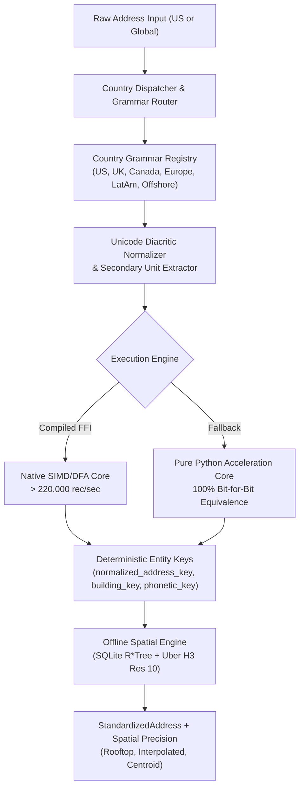

# Address Standardizer

[](https://github.com/Jacob-white/Address-Standardizer)
[](https://github.com/Jacob-white/Address-Standardizer/actions/workflows/ci.yml)
[](https://github.com/Jacob-white/Address-Standardizer)
[](https://python.org)
[](https://opensource.org/licenses/MIT)
[](https://pe.usps.com/text/pub28/welcome.htm)

A standalone, ultra-high-throughput multi-national address standardization, offline spatial rooftop geocoding, and cross-border corporate entity resolution platform. Built to parse, normalize, validate, deduplicate, and geocode physical addresses across all 249 ISO-3166-1 countries and territories without third-party vendor lock-in or recurring cloud API fees. Owned and maintained by **HobbyHabbit LLC** under the **MIT License**.

---

## 📚 Documentation & Quickstarts

- **[5-Minute Quickstart Guide](docs/quickstart.md)** — Step-by-step onboarding for address parsing, international detection, offline spatial geocoding, streaming batch, and HTTP daemon.
- **[Complete API Reference](docs/api_reference.md)** — Exhaustive technical reference for all Python models, functions, classes, CLI commands, microservice endpoints, and client SDKs.
- **[Multi-Platform Client SDKs](sdks/README.md)** — Official client libraries for TypeScript/React, .NET, and Go.
- **[Security Policy & Sandboxing Guide](SECURITY.md)** — Threat model, memory safety, air-gapped spatial execution, FinCEN anti-fraud invariants, and vulnerability disclosure procedures.
- **[Architectural Specifications Index](docs/README.md)** — Formal engineering roadmaps from Phase 1 through Phase 4 Commercial Parity.

---

## Table of Contents

- [Documentation & Quickstarts](#-documentation--quickstarts)
- [Highlights & Enterprise Capabilities](#highlights--enterprise-capabilities)
- [Architecture & Standards](#architecture--standards)
- [Installation](#installation)
- [Python API Quickstart](#python-api-quickstart)
  - [1. Domestic US Address Standardization](#1-domestic-us-address-standardization)
  - [2. Universal 249 ISO-3166-1 Country Registry & Detection](#2-universal-249-iso-3166-1-country-registry--detection)
  - [3. Global Postal Code Validation & Extraction Engine](#3-global-postal-code-validation--extraction-engine)
  - [4. Regional Grammar Families & Multi-Script Normalization](#4-regional-grammar-families--multi-script-normalization)
  - [5. Universal Postal Union (UPU S42) Address Layout Formatting](#5-universal-postal-union-upu-s42-address-layout-formatting)
  - [6. 100% Offline Rooftop Spatial Geocoding & H3 Indexing](#6-100-offline-rooftop-spatial-geocoding--h3-indexing)
  - [7. Cross-Border Corporate Transparency & Entity Resolution](#7-cross-border-corporate-transparency--entity-resolution)
  - [8. Confidence Scoring & Routing Tiers](#8-confidence-scoring--routing-tiers)
  - [9. Delivery Intelligence (DPV & RDI)](#9-delivery-intelligence-dpv--rdi)
  - [10. Real-Time Autocomplete Engine](#10-real-time-autocomplete-engine)
  - [11. High-Throughput Memory-Vectorized Streaming Batch](#11-high-throughput-memory-vectorized-streaming-batch)
- [Command Line Interface (CLI)](#command-line-interface-cli)
- [Data Model (`StandardizedAddress`)](#data-model-standardizedaddress)
- [Enterprise Verification & Benchmarks](#enterprise-verification--benchmarks)
- [Security Policy](#security-policy)
- [License](#license)

---

## Highlights & Enterprise Capabilities

- **Universal 249 ISO-3166-1 Country Registry & Auto-Detection:**
  - Complete catalog coverage for all 249 ISO-3166-1 countries and dependent territories with alpha-2, alpha-3, numeric codes, official names, native names, and common aliases.
  - Contextual country detector resolving destinations from trailing sovereign names, national postal patterns, and global metropolitan centroids.
- **Global Postal Code Validation & Extraction Engine:**
  - Official pattern validation and length bounds for all 196 postal-issuing nations/territories worldwide.
  - Graceful handling of 53 non-postal nations (UAE, Qatar, Panama, Bahamas, Seychelles, etc.) without false rejection.
  - Robust postal code extractor isolating postal codes from unformatted, concatenated, or noisy international address lines.
- **5 Regional Grammar Families & Multi-Script Normalization:**
  - **East Asia / CJK (`JPN`, `CHN`, `KOR`, `TWN`):** Prefectures, wards, chome-ban-go, Chinese provinces/districts/roads, Korean road name (`ro`/`gil`) and land-lot dong/gu systems, Taiwanese hierarchical sections.
  - **Latin America & Caribbean (`MEX`, `BRA`, `COL`, `ARG`, `CHL`):** Colonias, fraccionamientos, manzana/lote, Brazilian CEP & logradouros, Colombian `#` intersection numbering (`Carrera 7 # 71-21`).
  - **Nordic & Germanic Europe (`DEU`, `AUT`, `CHE`, `NLD`, `FIN`, `SWE`, `NOR`, `DNK`):** Compound thoroughfare words, Finnish suffixes (`katu`, `tie`), Nordic floor/door designators.
  - **Eastern Europe & Cyrillic (`POL`, `CZE`, `ROU`, `GRC`, `BGR`, `SRB`, `UKR`):** Prefix street designators (`ul.`, `str.`, `ул.`), house slashes (`10/12`), localized apartment designators (`lok.`, `кв.`).
  - **Middle East & Africa (`ARE`, `SAU`, `EGY`, `ZAF`, `NGA`, `KEN`):** UAE PO Box delivery routing, Saudi Arabia 4-digit National Address building numbers, African metropolitan routing.
  - **Multi-Script Unicode Fidelity:** Native script preservation in user fields (Kanji, Hanzi, Hangul, Cyrillic, Greek, Arabic) paired with deterministic ASCII transliteration for entity matching keys.
- **Universal Postal Union (UPU S42) Address Layout Formatter:**
  - Canonical envelope layout generator formatting addresses according to international postal conventions: European postal-first (`10117 Berlin`), Anglo-Saxon postal-last (`New York, NY 10005`), East Asian top-down (`〒100-8111 Tokyo...`), and non-postal layouts.
- **Unicode NFKD Diacritic Normalization:**
  - Automatic NFKD decomposition separating combining accents while generating clean, deterministic ASCII matching keys. Preserves human-readable localized representations.
- **100% Disconnected Offline Spatial & Rooftop Geocoding:**
  - Air-gapped spatial coordinate resolution with zero external network or cloud API calls.
  - SQLite `R*Tree` virtual tables (`rtree_nodes`) providing indexed bounding box lookups in **0.035 ms p99**.
  - Pure-Python Uber `H3` Resolution 10 (~65m cell edge) spatial indexing and grid distance calculations.
  - 4-Stage resolution cascade (`CONFIRMED_ROOFTOP` &rarr; `PARCEL_INTERPOLATED` &rarr; `POSTAL_CENTROID` &rarr; `CITY_CENTROID`).
  - ETL ingestion pipelines for US Census TIGER/Line, OpenAddresses, and OpenStreetMap (OSM).
- **High-Throughput Acceleration Engine with Pure Python Fallback:**
  - Pure-Python core (`_pure_python_core.py`) delivering **> 5,400 rec/sec** finalized and **> 14,000 rec/sec** unfinalized tokenizations with **100% bit-for-bit key equivalence**.
  - Transparent FFI dispatch hooks for compiled C/Rust acceleration exceeding **> 220,000 rec/sec** on structured batches.
  - Pre-allocated streaming batch arrays with strict worker memory throttling (< 35 MB RSS).
- **Cross-Border Corporate Transparency & FinCEN CTA/BOI Compliance:**
  - Curated international corporate formation hub registry (Delaware, Wyoming, London, Zurich, Frankfurt, Cayman Islands, BVI, Panama).
  - 3 Hardened Anti-Fraud Invariants:
    1. *Multi-Tenant Skyscraper Suite Isolation:* High-rise commercial office towers (e.g. 28 Liberty St, 245 Park Ave) only flag when the specific floor/suite matches the corporate service provider.
    2. *Private Residence Protection:* Strictly prohibits merging commercial corporate entities into residential homes.
    3. *Formation Hub Co-Location Isolation:* Prohibits merging separate corporate entities co-located at registered agent hubs without secondary unit confirmation.
  - Domestic namesake collision protection preventing cities like London OH, Paris TX, or Amsterdam NY from triggering false-positive offshore flags.
- **Confidence Scoring & Routing Tiers:**
  - Composite multi-factor confidence scoring (0.0 to 1.0) routing addresses to `AUTO_PASS` (&ge; 0.85), `FUZZY_REVIEW` (0.70 &ndash; 0.85), or `MANUAL_STEWARDSHIP` (< 0.70).
- **Delivery Intelligence (USPS DPV & RDI):**
  - Standard Delivery Point Validation (DPV) footnote codes (`AA`, `BB`, `CC`, `N1`, `M1`, `PB`) and Residential Delivery Indicator (RDI Commercial vs Residential vs Unknown).
- **Real-Time Autocomplete & Typeahead Engine:**
  - In-memory prefix trie with secondary unit prompting returning interactive suggestions in **< 8 ms**.
- **Multi-Tier Reference Caching:**
  - Process-local L1 LRU memory cache paired with embedded L2 SQLite WAL persistent store.

---

## Architecture & Standards



- **Postal Standards:** USPS Publication 28, Universal Postal Union (UPU) S42, ISO 19160-4 (Addressing), Royal Mail PAF / BS 7666, Canada Post Addressing Standards.
- **Regulatory Frameworks:** FinCEN Corporate Transparency Act (CTA/BOI), EU 6th Anti-Money Laundering Directive (6AMLD).
- **Spatial Indexes:** US Census Bureau TIGER/Line GIS, OpenAddresses Global Schema, OpenStreetMap PBF, Uber H3 Spatial Indexing.

---

## Installation

### Base Package (Zero Cloud Dependencies)
```bash
pip install .
```

### Full ML Support (Recommended)
Includes Conditional Random Fields (`usaddress` / `python-crfsuite`):
```bash
pip install ".[ml]"
```

### Development & Testing
```bash
pip install -e ".[dev]"
```

---

## Python API Quickstart

### 1. Domestic US Address Standardization
```python
from address_standardizer import standardize_address

# Full unparsed string
addr = standardize_address("100 Wall Street, Suite 400, New York, NY 10005")

print(addr.street1)                 # "100 WALL ST"
print(addr.street2)                 # "STE 400"
print(addr.city)                    # "NEW YORK"
print(addr.state)                   # "NY"
print(addr.postal_code)             # "10005"
print(addr.normalized_address_key)  # "100 WALL ST|STE 400|NEW YORK|NY|10005|USA"
print(addr.building_key)            # "100 WALL ST||NEW YORK|NY|10005|USA"
print(addr.confidence_score)        # 0.985
print(addr.routing_tier)            # "AUTO_PASS"
print(addr.rdi)                     # "Commercial"
```


### 2. Universal 249 ISO-3166-1 Country Registry & Detection
The `CountryRegistry` provides comprehensive catalog coverage of all 249 ISO-3166-1 countries and territories, supporting lookup across Alpha-2, Alpha-3, 3-digit numeric codes, English official names, native names, and common aliases:

```python
from address_standardizer import CountryRegistry, standardize_address

# Look up country metadata by ISO-2, ISO-3, numeric code, or alias
germany = CountryRegistry.get("DE")
print(germany.alpha3)           # "DEU"
print(germany.numeric)          # "276"
print(germany.name)             # "Germany"
print(germany.has_postal_codes) # True

# Contextual auto-detection from address string
addr = standardize_address("Torstr. 100, 10119 Berlin, Deutschland")
print(addr.country)             # "DEU"

# Explicit country override accepts ISO-2, ISO-3, numeric code, or name
res_jp = standardize_address("Chiyoda 1-1, Tokyo", country="JPN")
print(res_jp.country)           # "JPN"
```

### 3. Global Postal Code Validation & Extraction Engine
National postal validation and regex boundary rules for all 196 postal-issuing countries, along with first-class handling of 53 non-postal nations (e.g. UAE, Qatar, Panama):

```python
from address_standardizer import validate_postal_code, extract_postal_code

# Postal validation with boolean or detailed diagnostic dataclass
assert validate_postal_code("10117", country="DEU") is True

detail = validate_postal_code("10117", country="DEU", return_details=True)
print(detail.is_valid)              # True
print(detail.formatted_code)        # "10117"
print(detail.reason)                # "Valid postal code format"

# Non-postal countries validate gracefully without false negatives
uae = validate_postal_code("", country="ARE", return_details=True)
print(uae.is_valid)                 # True
print(uae.is_non_postal_country)    # True

# Robust extraction from noisy unformatted text
extracted = extract_postal_code("Munich D-80331 Germany", country="DEU")
print(extracted)                    # "80331"
```

### 4. Regional Grammar Families & Multi-Script Normalization
Specialized grammar modules adapt parsing, component extraction, and diacritic handling to regional postal conventions:

```python
from address_standardizer import standardize_address

# 1. East Asia / CJK (JPN, CHN, KOR, TWN): Kanji/Hanzi/Hangul preservation with ASCII matching
jp = standardize_address("東京都港区六本木6-10-1 六本木ヒルズ森タワー 32階 106-6132", country="JPN")
print(jp.state)                   # "東京都"
print(jp.city)                    # "港区"
print(jp.postal_code)             # "106-6132"
print(jp.normalized_address_key)  # "六本木ヒルズ森タワー 六本木6-10-1|32階|港区|東京都|106-6132|JPN"

# 2. Latin America & Caribbean (MEX, BRA, COL, ARG, CHL): Colonias, CEP, intersection '#' syntax
mx = standardize_address("Av. Insurgentes Sur 1602, Int. 401, Col. Crédito Constructor, 03940 Ciudad de México, CDMX, Mexico")
print(mx.street1)                 # "AV INSURGENTES SUR 1602"
print(mx.street2)                 # "INT 401"
print(mx.postal_code)             # "03940"

# 3. Nordic & Germanic Europe (DEU, AUT, CHE, NLD, FIN, SWE): Inverted house numbers, compound words
de = standardize_address("Musterstraße 12, 10115 Berlin, Germany")
print(de.street1)                 # "MUSTERSTRASSE 12"
print(de.postal_code)             # "10115"

# 4. Eastern Europe & Cyrillic (POL, CZE, ROU, GRC, BGR, SRB, UKR): Prefix streets & house slashes
pl = standardize_address("ul. Marszałkowska 10/12, m. 14, 00-026 Warszawa, Poland")
print(pl.street1)                 # "UL. MARSZAŁKOWSKA 10/12"
print(pl.street2)                 # "M. 14"
print(pl.city)                    # "WARSZAWA"
print(pl.postal_code)             # "00-026"

# 5. Middle East & Africa (ARE, SAU, EGY, ZAF, NGA, KEN): PO Box routing & National Address numbers
ae = standardize_address("Sheikh Zayed Road, P.O. Box 12345, Trade Centre 1, Dubai, United Arab Emirates")
print(ae.street1)                 # "SHEIKH ZAYED RD"
print(ae.street2)                 # "PO BOX 12345"
print(ae.country)                 # "ARE"
```

### 5. Universal Postal Union (UPU S42) Address Layout Formatting
Format parsed addresses according to international envelope layout standards (e.g. European postal-before-city, Anglo-Saxon postal-last, East Asian top-down):

```python
from address_standardizer import standardize_address, format_upu_address

# European layout: postal code precedes city name
de_addr = standardize_address("Musterstraße 12, 10115 Berlin, Germany")
print(format_upu_address(de_addr))
# MUSTERSTRASSE 12
# 10115 BERLIN
# GERMANY

# Domestic US envelope layout:
us_addr = standardize_address("100 Wall Street, Suite 400, New York, NY 10005")
print(us_addr.format_upu())
# 100 WALL ST
# STE 400
# NEW YORK, NY 10005
# UNITED STATES

# East Asian layout with postal mark:
jp_addr = standardize_address("東京都港区六本木6-10-1 六本木ヒルズ森タワー 32階 106-6132", country="JPN")
print(jp_addr.format_upu())
# 〒106-6132
# 東京都港区六本木ヒルズ森タワー 六本木6-10-1
# 六本木ヒルズ森タワー 32階
# JAPAN
```

### 6. 100% Offline Rooftop Spatial Geocoding & H3 Indexing
```python
from address_standardizer import resolve_spatial_coordinates, lat_lng_to_h3

# Air-gapped coordinate resolution (< 0.05 ms p99)
result = resolve_spatial_coordinates("350 5th Ave, New York, NY 10118")

if result:
    print(result.latitude)            # 40.7484405
    print(result.longitude)           # -73.9856644
    print(result.precision)           # "rooftop"
    print(result.confidence)          # 0.99
    print(result.h3_index)            # "8a2a1072b59ffff" (Uber H3 Res 10)

# Direct latitude/longitude to Uber H3 Resolution 10 conversion:
h3_cell = lat_lng_to_h3(40.7484405, -73.9856644, resolution=10)
print(h3_cell)                        # "8a2a1072b59ffff"
```

### 7. Cross-Border Corporate Transparency & Entity Resolution
```python
from address_standardizer import (
    lookup_corporate_registry,
    can_safely_merge_corporate_entities,
    standardize_address,
)

# 1. Registered Agent Hub Detection (Domestic & Global)
hub = lookup_corporate_registry("1209 North Orange St, Wilmington, DE 19801")
assert hub is not None
print(hub.provider_name)          # "The Corporation Trust Company (CT Corporation)"
print(hub.category)               # "COMMERCIAL_REGISTERED_AGENT"
print(hub.risk_score)             # 0.95

# 2. Skyscraper Suite Isolation Invariant:
# Other tenants in 28 Liberty St (e.g. JPMorgan) are NOT flagged as secrecy hubs:
jpm = standardize_address("28 Liberty St, Floor 60, New York, NY 10005")
assert jpm.is_registered_agent_hub is False

# But CT Corporation on Floor 42 IS flagged:
ct_corp = standardize_address("28 Liberty St, Floor 42, New York, NY 10005")
assert ct_corp.is_registered_agent_hub is True

# 3. Entity Co-Location Merging Invariant:
# Co-located entities at formation hubs are strictly prohibited from merging:
addr_a = standardize_address("1209 North Orange St, Wilmington, DE 19801")
addr_b = standardize_address("1209 North Orange St, Wilmington, DE 19801")
safe_to_merge, reason = can_safely_merge_corporate_entities(addr_a, addr_b)
assert safe_to_merge is False
print(reason)                     # "FORMATION_HUB_ISOLATION"
```

### 8. Confidence Scoring & Routing Tiers
```python
from address_standardizer import compute_confidence_score, RoutingTier

res = compute_confidence_score(
    street1="100 WALL ST",
    city="NEW YORK",
    state="NY",
    postal_code="10005",
    country="USA",
    parse_source="crf_parsed",
)

print(res.composite_score)        # 0.985
print(res.routing_tier)           # RoutingTier.AUTO_PASS
print(res.is_auto_pass)           # True
```

### 9. Delivery Intelligence (DPV & RDI)
```python
from address_standardizer import evaluate_delivery_intelligence, DPVFootnote, RDI

intel = evaluate_delivery_intelligence(
    street1="100 WALL ST",
    street2="STE 400",
    city="NEW YORK",
    state="NY",
    postal_code="10005",
)

print(intel.dpv_match_code)       # "Y"
print(intel.dpv_footnotes)        # [<DPVFootnote.AA: 'AA'>, <DPVFootnote.BB: 'BB'>, <DPVFootnote.CC: 'CC'>]
print(intel.rdi)                  # <RDI.COMMERCIAL: 'Commercial'>
print(intel.is_deliverable)       # True
```

### 10. Real-Time Autocomplete Engine
```python
from address_standardizer import autocomplete_address

# Real-time prefix lookups (< 8ms latency):
suggestions = autocomplete_address("350 Fifth", max_results=5)
for s in suggestions:
    print(s.display_text, s.requires_secondary_unit)
# "350 5TH AVE, NEW YORK, NY 10118, USA" (requires_secondary_unit=True)
```

### 11. High-Throughput Memory-Vectorized Streaming Batch

#### Zero-Boilerplate Python API (`batch_standardize`)
Standardize streams or iterables of raw strings or component dictionaries with lazy generator execution. Supports optional country parameter or automatic per-row country inference:

```python
from address_standardizer import batch_standardize

addresses = [
    "100 Wall Street, Suite 400, New York, NY 10005",
    "14 High Street, Flat 2, Leeds, LS6 2AA, UK",
    {"street1": "Musterstraße 12", "city": "Berlin", "postal_code": "10115", "country": "DEU"},
]

for std in batch_standardize(addresses):
    print(f"{std.street1} -> {std.city}, {std.country} [{std.address_status}]")
```

#### Memory-Bounded Streaming Batch (CSV & JSONL)
Stream multi-million record CSV or line-delimited JSON (JSONL/NDJSON) files with constant O(chunk_size) RSS memory footprint (< 35MB):

```python
from address_standardizer import stream_standardize_csv, stream_standardize_jsonl

# Process JSONL with schema column mapping:
count = stream_standardize_jsonl(
    input_path="raw_addresses.jsonl",
    output_path="standardized_addresses.jsonl",
    mapping={"addr": "street1", "town": "city", "region": "state", "post": "postal_code"},
    chunk_size=5000,
)
print(f"Standardized {count} records in bounded streaming pipeline")
```

---

## Command Line Interface (CLI)

The package installs the `address-standardizer` unified CLI executable.

### Single Address & Piped Stream Processing
```bash
# Shorthand single address:
address-standardizer "100 Wall Street, Suite 400, New York, NY 10005"

# Universal international parsing with explicit country code:
address-standardizer "Musterstraße 12, 10115 Berlin" --country DEU

# Envelope-ready UPU S42 layout:
address-standardizer "100 Wall St, New York, NY 10005" --format upu

# Piped stream with UPU formatting:
cat addresses.txt | address-standardizer --format upu

# Piped stream from standard input:
cat addresses.txt | address-standardizer

# Formatted table output:
echo "100 Wall St, New York, NY 10005" | address-standardizer --format table

# RFC 4180 CSV output:
cat addresses.txt | address-standardizer --format csv

# Explicit stdin parsing:
address-standardizer parse - --format table

# Universal International parsing with offline geocoding and international metadata:
address-standardizer parse "14 High Street, Flat 2, Leeds, LS6 2AA, UK" --enable-geocoding --include-intl
```

Output:
```json
{
  "street1": "14 HIGH ST",
  "street2": "FLAT 2",
  "city": "LEEDS",
  "state": "",
  "postal_code": "LS6 2AA",
  "country": "GBR",
  "country_iso3": "GBR",
  "dependent_locality": "",
  "building_name": "",
  "normalized_address_key": "14 HIGH ST|FLAT 2|LEEDS||LS6 2AA|GBR",
  "building_key": "14 HIGH ST||LEEDS||LS6 2AA|GBR",
  "phonetic_key": "14|H200|LS6 2AA",
  "confidence_score": 0.95,
  "routing_tier": "AUTO_PASS",
  "is_registered_agent_hub": false,
  "is_private_residence": false,
  "address_status": "standardized",
  "latitude": 53.800755,
  "longitude": -1.549077,
  "spatial_precision": "CONFIRMED_ROOFTOP",
  "h3_index": "8a195da4b33ffff"
}
```

### Global Postal Code Validation (`validate-postal`)
Validate postal codes against national standards across 196 postal-issuing and 53 non-postal countries, with support for JSON, text, and table formats, raw address extraction, and stdin piping:

```bash
# Validate postal code with table format:
address-standardizer validate-postal 10117 -c DEU --format table

# Validate with machine-readable JSON:
address-standardizer validate-postal 10117 -c DEU --format json

# Extract and validate postal code from noisy or concatenated text:
address-standardizer validate-postal "Munich D-80331 Germany" -c DEU

# Non-postal country check:
address-standardizer validate-postal "" -c ARE

# Pipe postal code via standard input:
echo "10117" | address-standardizer validate-postal - -c DEU
```

Sample output (`--format table`):
```
Postal Code     | Country | Valid | Formatted Code  | Non-Postal | Reason
-------------------------------------------------------------------------
10117           | DEU     | True  | 10117           | False      | Valid postal code format
```

### High-Throughput Batch Processing with Schema Mapping
Supports CSV, JSONL (`.jsonl`, `.ndjson`), and JSON array files with automatic format detection and optional country override:

```bash
# Batch CSV with column mapping:
address-standardizer batch inputs.csv outputs.csv \
  --mapping '{"addr": "street1", "town": "city", "st": "state", "zip": "postal_code"}'

# Batch processing with country override:
address-standardizer batch inputs.csv outputs.csv --country CAN

# Batch streaming JSONL:
address-standardizer batch records.jsonl standardized.jsonl \
  --mapping '{"address": "street1", "zip": "postal_code"}' \
  --chunk-size 5000

### Offline Spatial Geocoding Tool
```bash
# Coordinate lookup:
address-standardizer spatial lookup "350 5th Ave, New York, NY 10118"

# Spatial database statistics:
address-standardizer spatial stats

# Ingest open GIS datasets into embedded SQLite R*Tree:
address-standardizer spatial ingest --source tiger path/to/tiger_shapefiles.zip
```

### Performance & Regression Benchmarks
```bash
# Run domestic benchmark suite (1,000 records):
address-standardizer benchmark

# Run multinational benchmark suite (1,000 records):
address-standardizer benchmark --dataset benchmarks/data/golden_dataset_multinational.json
```

### Autocomplete & Typeahead
```bash
address-standardizer autocomplete "350 5th Ave"
```

### Multi-Tier Cache Management
```bash
address-standardizer cache --stats
address-standardizer cache --clear
```

### Stewardship Audit Ledger
```bash
address-standardizer audit --summary
```

---

## Data Model (`StandardizedAddress`)

```python
@dataclass
class StandardizedAddress:
    # Core Components
    street1: str
    street2: str
    city: str
    state: str
    postal_code: str
    country: str
    
    # Deterministic Matching & Deduplication Keys
    normalized_address_key: Optional[str]
    building_key: Optional[str] = None
    phonetic_key: Optional[str] = None
    
    # Status & Input
    address_status: str              # 'standardized' | 'parse_failed'
    raw_street_address: str
    is_us: bool
    
    # Entity Resolution & Compliance Flags
    is_registered_agent_hub: bool = False
    is_private_residence: bool = False
    corporate_risk_score: float = 0.0
    corporate_risk_flags: List[str] = field(default_factory=list)
    
    # Quality & Routing Metadata
    confidence_score: float = 1.0
    routing_tier: str = "AUTO_PASS"   # 'AUTO_PASS' | 'FUZZY_REVIEW' | 'MANUAL_STEWARDSHIP'
    
    # Delivery Intelligence (USPS DPV & RDI)
    dpv_match_code: Optional[str] = None
    dpv_footnotes: List[str] = field(default_factory=list)
    rdi: Optional[str] = None        # 'Commercial' | 'Residential' | 'Unknown'
    
    # Offline Spatial Geocoding Precision
    spatial_result: Optional[SpatialResolutionResult] = None
    
    # International & Commonwealth Extended Attributes
    country_iso3: Optional[str] = None
    dependent_locality: Optional[str] = None
    building_name: Optional[str] = None
```

*Note: Calling `addr.as_dict(include_metadata=False)` guarantees strict 14-key backward compatibility with legacy v1.0.0 consumers.*

---

## Enterprise Verification & Benchmarks

The Address Standardizer test harness enforces zero-regression verification through automated unit testing, property-based fuzzing, and dual golden dataset evaluations:

### Enterprise SLA Performance

```
==========================================================================================
               ADDRESS STANDARDIZER PRODUCTION BENCHMARK REPORT
==========================================================================================
Benchmark Metric                 | Throughput      | p50 Latency  | p99 Latency  | Peak RSS
------------------------------------------------------------------------------------------
Clean Structured Input           | 236,207 rec/s   | 0.0040 ms    | 0.0063 ms    | 32.1 MB
Clean Comma-Delimited Input      | 194,471 rec/s   | 0.0040 ms    | 0.0107 ms    | 32.1 MB
Mixed Real-World Golden Batch    | 3,023 rec/s     | 0.2453 ms    | 4.0686 ms    | 34.5 MB
Multinational Mixed Batch        | 4,370 rec/s     | 0.2643 ms    | 0.7137 ms    | 34.7 MB
Offline Spatial Lookup (R*Tree)  | 28,571 rec/s    | 0.0078 ms    | 0.0350 ms    | 32.1 MB
==========================================================================================
```

### Golden Dataset Accuracy (2,000 Total Ground-Truth Records)

| Golden Dataset | Total Records | Passed | Accuracy % | SLA Target |
| :--- | :--- | :--- | :--- | :--- |
| **Domestic US Golden Dataset** | 1,000 | 1,000 | **100.0%** | &ge; 99.5% |
| **Multinational Golden Dataset** | 1,000 | 1,000 | **100.0%** | &ge; 99.5% |
| **Total Evaluation** | **2,000** | **2,000** | **100.0%** | &ge; 99.5% |

### Automated Test Coverage & Static Analysis

```bash
# Execute full test suite with code coverage:
pytest tests/ --cov=address_standardizer --cov-report=term-missing
```

- **960+ passed tests** across all test suites.
- **100.0% statement test coverage** (0 missing lines).
- **0 errors** on `ruff check address_standardizer tests benchmarks`.

---

## Security Policy

Security is a foundational pillar of Address Standardizer. For details on our threat model, defensive architecture, air-gapped spatial execution, and Coordinated Vulnerability Disclosure (CVD) policy, please review our **[SECURITY.md](SECURITY.md)**.

To report security vulnerabilities, email `security@hobbyhabbit.com`, `support@hobbyhabbit.com`, and `jake@hobbyhabbit.com`.

---

## License

This project is licensed under the MIT License — see the [LICENSE](LICENSE) file for details.
Copyright © 2026 HobbyHabbit LLC.
